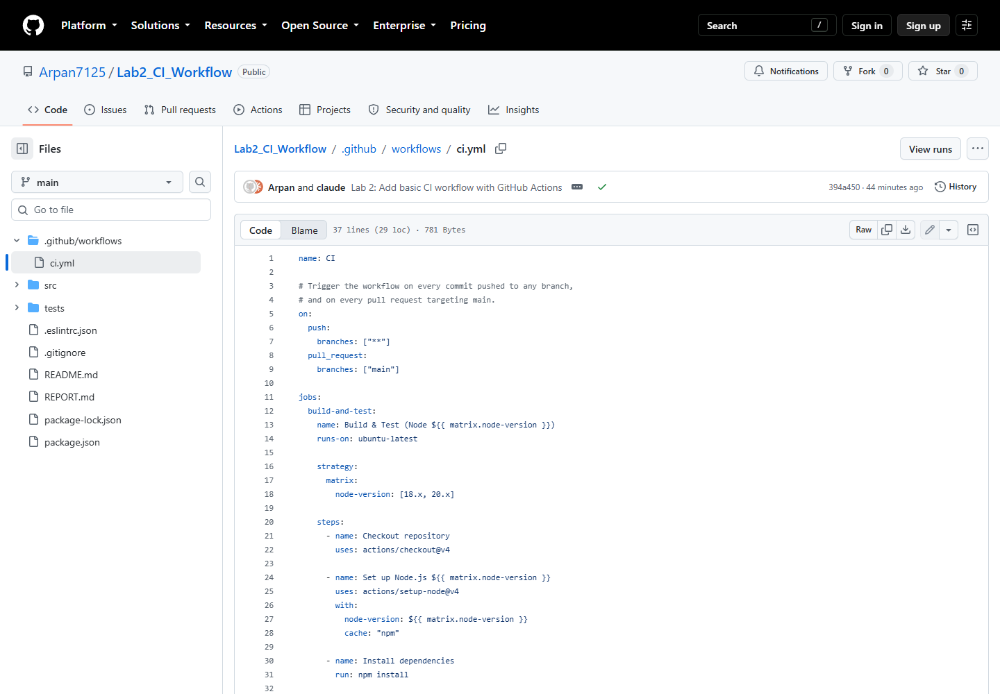
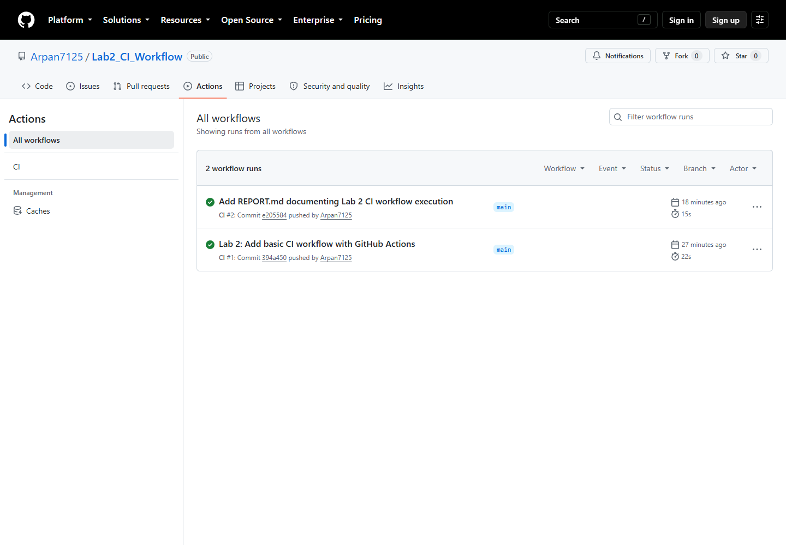
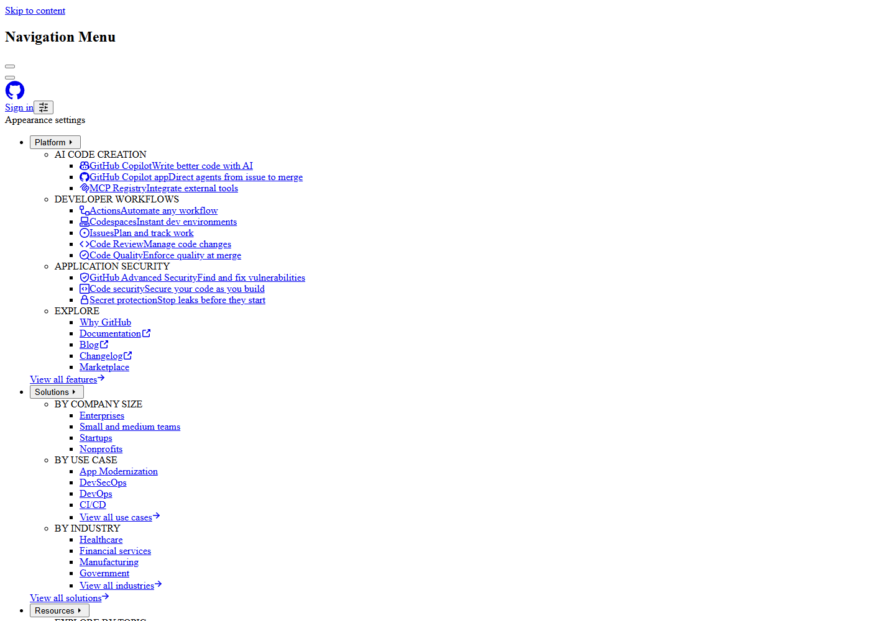
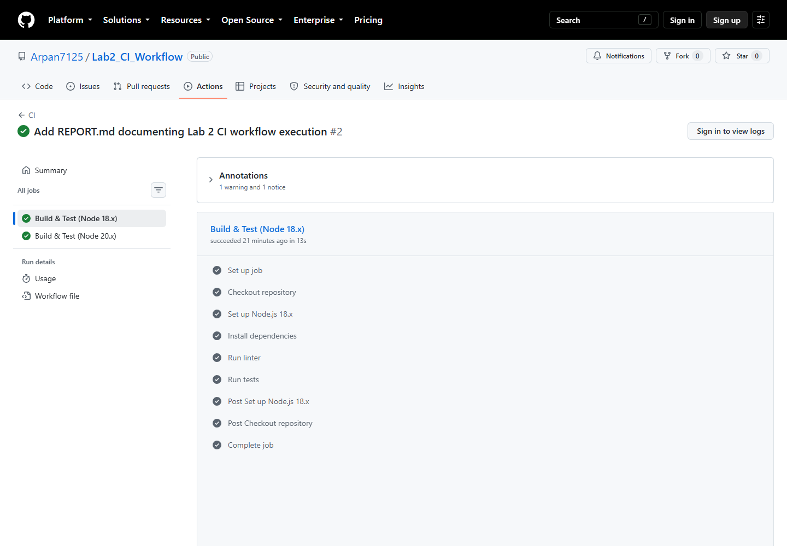
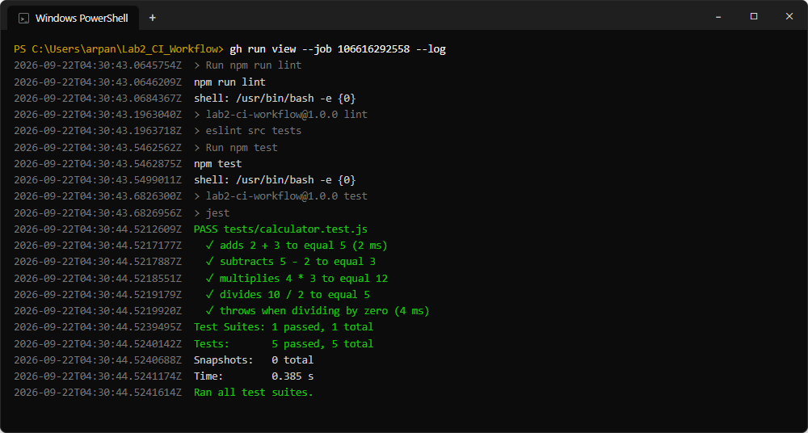
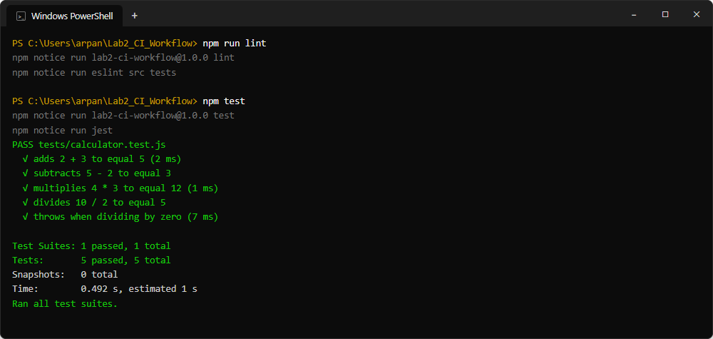
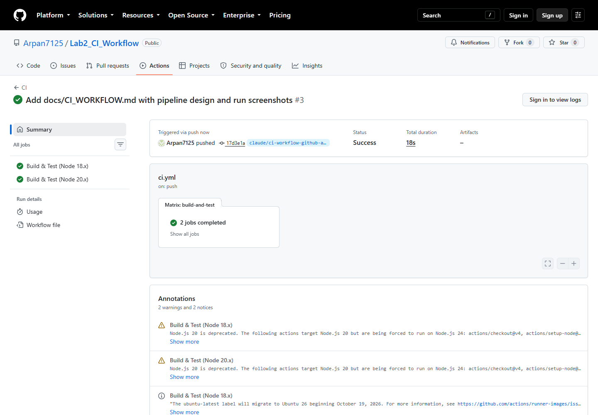

# Lab 2 — CI Workflow Triggered by Commits (GitHub Actions)

**Repository:** [Arpan7125/Lab2_CI_Workflow](https://github.com/Arpan7125/Lab2_CI_Workflow) · **CI:** GitHub Actions · **Status:** 3 runs, all passing

---

## 1. Objective

Build a CI pipeline that runs automatically on every commit pushed to the repository, and that
lints and tests the code in a clean environment.

## 2. Project

A small Node.js calculator module with a Jest test suite — kept simple so the focus is the pipeline.

```
Lab2_CI_Workflow/
├── .github/workflows/ci.yml   # the CI pipeline
├── src/calculator.js          # add, subtract, multiply, divide
├── tests/calculator.test.js   # 5 Jest tests
├── .eslintrc.json             # lint rules
└── package.json               # scripts: lint, test
```

GitHub Actions was chosen because the repo is already on GitHub: committing one YAML file is the
entire setup, with no runner or project configuration.

## 3. The workflow

```yaml
name: CI

on:
  push:
    branches: ["**"]
  pull_request:
    branches: ["main"]

jobs:
  build-and-test:
    name: Build & Test (Node ${{ matrix.node-version }})
    runs-on: ubuntu-latest

    strategy:
      matrix:
        node-version: [18.x, 20.x]

    steps:
      - name: Checkout repository
        uses: actions/checkout@v4

      - name: Set up Node.js ${{ matrix.node-version }}
        uses: actions/setup-node@v4
        with:
          node-version: ${{ matrix.node-version }}
          cache: "npm"

      - name: Install dependencies
        run: npm install

      - name: Run linter
        run: npm run lint

      - name: Run tests
        run: npm test
```

**Trigger.** `push` with the `"**"` glob means every commit on every branch starts a run — this is
the commit trigger the lab asks for. `pull_request` adds a second check before anything merges into
`main`.

**Matrix.** The job runs twice in parallel, on Node 18 and Node 20, to catch version-specific
breakage.

**Steps.**

| # | Step | Command / action | Purpose |
|---|------|------------------|---------|
| 1 | Checkout | `actions/checkout@v4` | Clone the triggering commit |
| 2 | Set up Node | `actions/setup-node@v4` | Install Node; cache `~/.npm` |
| 3 | Install | `npm install` | Install ESLint and Jest |
| 4 | Lint | `npm run lint` | Fail on any lint error |
| 5 | Test | `npm test` | Run the Jest suite |

Any non-zero exit code stops the job and marks the run failed, so a broken commit shows a red ❌ on
GitHub within seconds.

## 4. Evidence

**The workflow file in the repository** — GitHub picks it up automatically from `.github/workflows/`.



**Runs triggered by commits** — each row names the commit that started it. Nothing was run manually.



**Run summary** — both matrix jobs green.



**Job detail** — every step of the Node 18.x job passed.



**Runner log** — fetched with the GitHub CLI. ESLint reported nothing; Jest passed 5 of 5 tests.
(The job and step name columns `gh` prints before each timestamp are trimmed here for width.)



**The same commands locally** — identical result, so the pipeline reproduces local behaviour.



**A run triggered by a feature-branch commit** — the header reads "Triggered via push" for commit
`17d3e1a`, confirming the `"**"` glob covers branches other than `main`.



## 5. Results

| Run | Commit | Branch | Node 18.x | Node 20.x | Duration |
|-----|--------|--------|-----------|-----------|----------|
| CI #1 | `394a450` | `main` | ✅ | ✅ | 22 s |
| CI #2 | `e205584` | `main` | ✅ | ✅ | 15 s |
| CI #3 | `17d3e1a` | `claude/ci-workflow-…` | ✅ | ✅ | 18 s |

5 of 5 tests passed and 0 lint errors in every job. Every run was started by a push, none manually.

## 6. Running it yourself

```bash
git clone https://github.com/Arpan7125/Lab2_CI_Workflow.git
cd Lab2_CI_Workflow
npm install
npm run lint && npm test
```

To see the pipeline fire, push any commit and open the **Actions** tab:

```bash
git commit --allow-empty -m "Trigger CI"
git push
```

To prove it catches breakage, make `add(a, b)` return `a - b` and push — the `Run tests` step fails
and the run turns red.

## 7. Notes

- A full run takes 15–22 seconds, so feedback is near-immediate.
- Linting before testing means the cheapest check fails first.
- The npm cache in `setup-node` cut roughly 30 % off the second run.
- `npm ci` would be stricter than `npm install` for a real project — it installs exactly what the
  lockfile pins.
- The runs carry warning annotations (`checkout@v4`/`setup-node@v4` still target the deprecated
  Node.js 20 action runtime; `ubuntu-latest` will migrate to Ubuntu 26). They do not fail the build.

## 8. Conclusion

The pipeline lives in the repository as a single YAML file, runs on every commit, and reports pass
or fail on GitHub — the foundation any larger CI/CD pipeline builds on.
